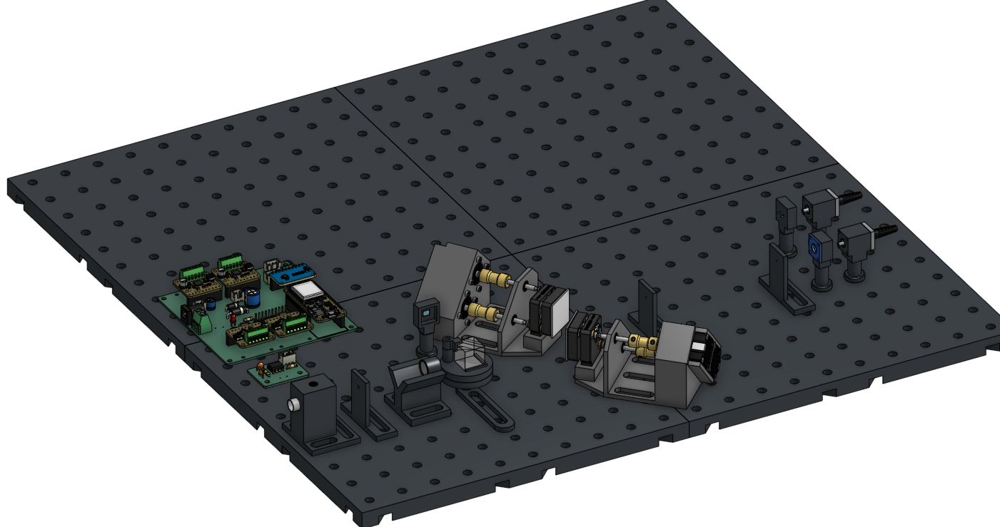
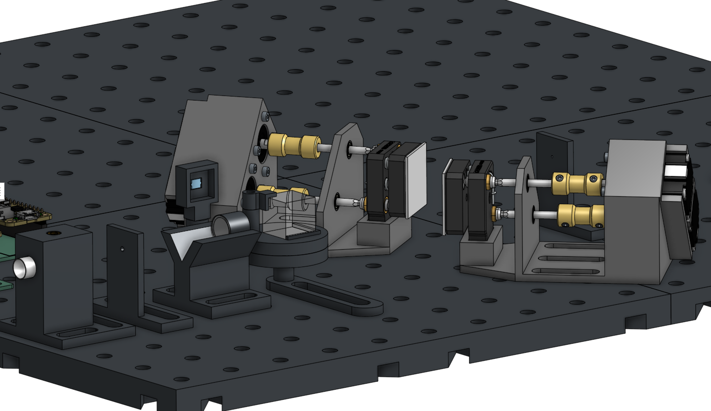
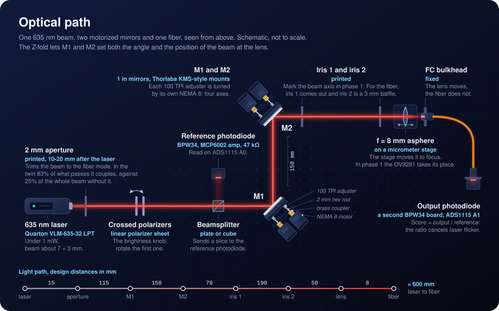
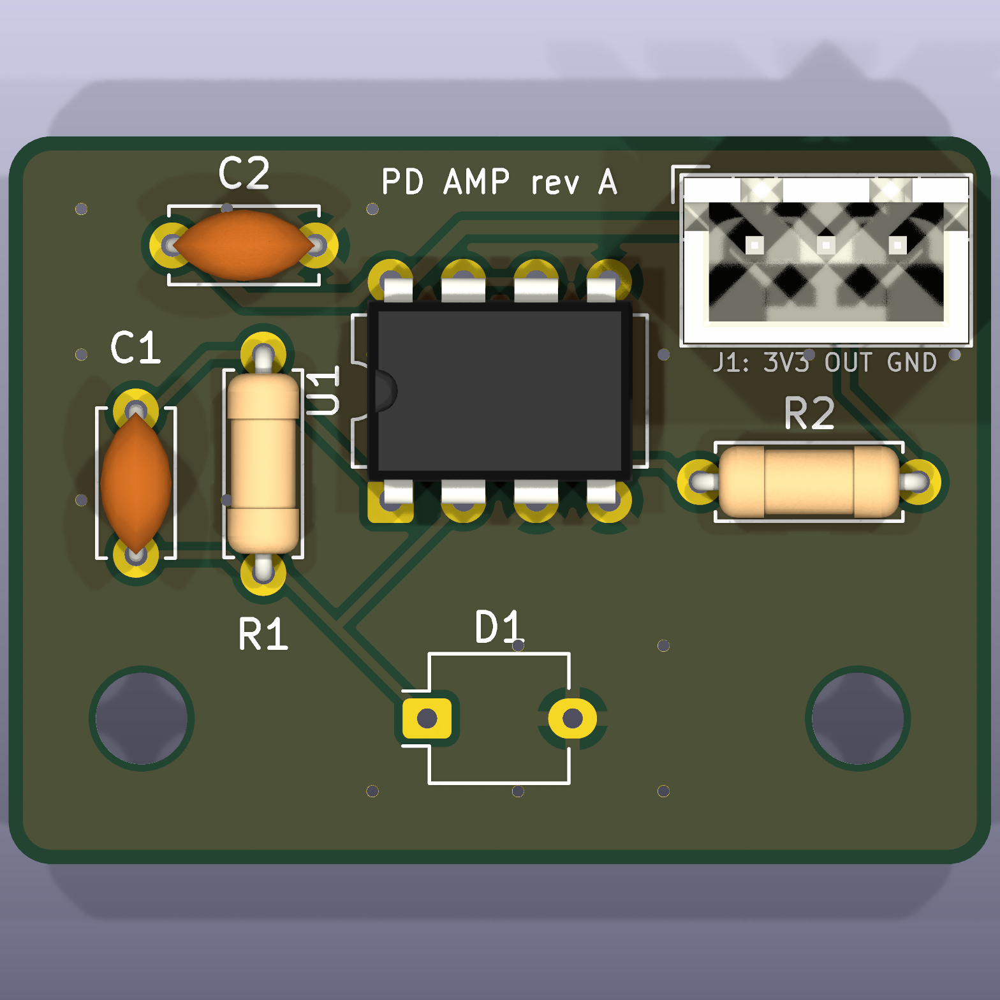
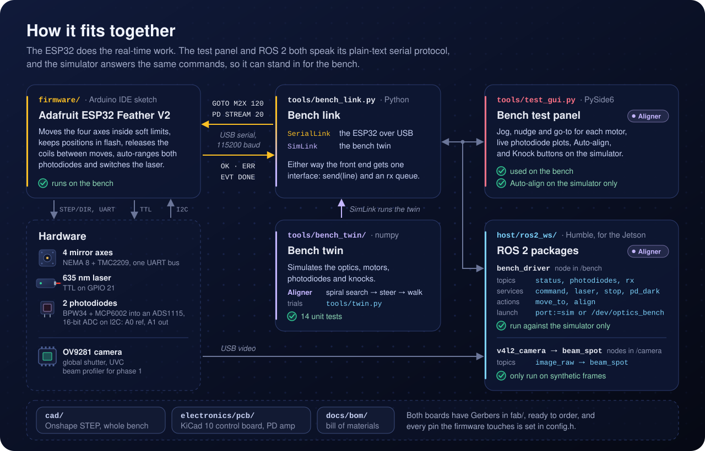
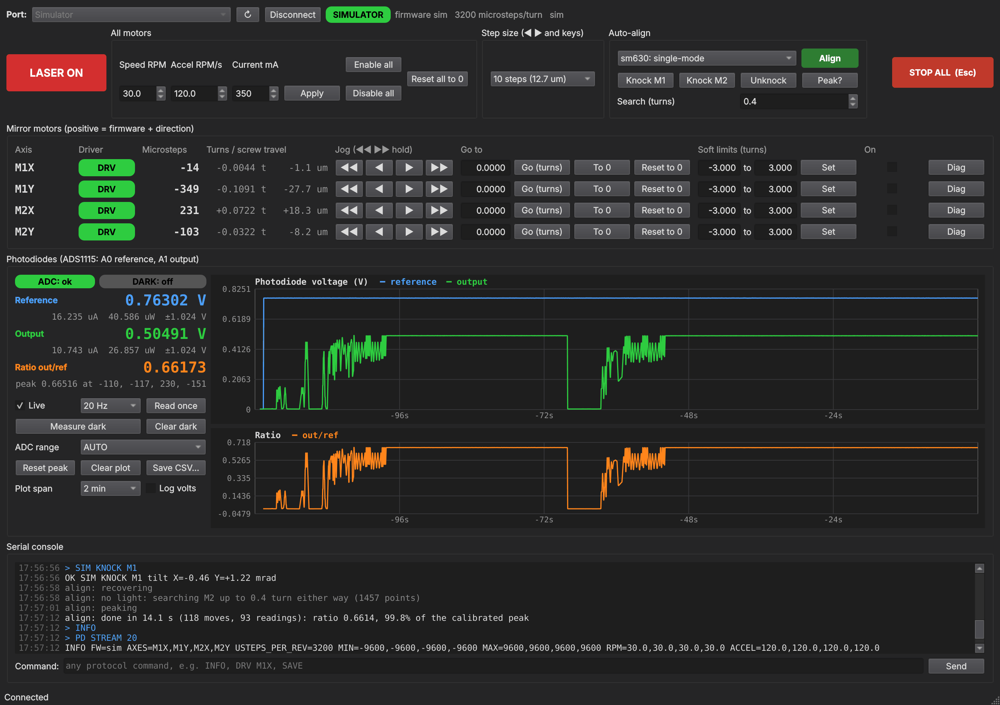

<p align="center">
  
</p>

<h3 align="center">A mostly 3D-printed optical bench that couples a 635 nm laser into an optical fiber by itself. Knock a mirror out of line and four stepper-driven adjusters steer the beam back to peak coupling, with no hands on the knobs.</h3>

<p align="center">
  
  
  
  
  
  
  
  
</p>

<p align="center">
  <a href="#how-it-works"><b>How it works</b></a> ·
  <a href="#the-bench"><b>The bench</b></a> ·
  <a href="#optical-path"><b>Optical path</b></a> ·
  <a href="#auto-align"><b>Auto-align</b></a> ·
  <a href="#electronics"><b>Electronics</b></a> ·
  <a href="#software"><b>Software</b></a> ·
  <a href="#roadmap"><b>Roadmap</b></a> ·
  <a href="docs/bom/README.md"><b>Parts list</b></a>
</p>

## How it works

Getting a laser into a single-mode fiber means landing a focused spot on a core a few microns across, at the right angle. By hand that takes two kinematic mirrors, four knobs and a lot of patience. Here a NEMA 8 stepper turns each knob, and two photodiodes tell the motors how close they are.

| 1 · Score the coupling | 2 · Find the light | 3 · Steer and walk |
|---|---|---|
| A beamsplitter sends part of the laser to a reference photodiode, and the fiber's output lands on a second one. Their ratio is the score, so laser flicker cancels out. | After a knock the spot has usually left the core and the output reads nothing. M2 steps the spot outward in a square spiral until the output photodiode sees light again. | M2 alone moves the spot across the core. M1 with a matched, opposite M2 move changes only the angle. Alternating the two climbs the long, thin peak that one-knob-at-a-time adjusting stalls on. |

## The bench

<p align="center">
  
</p>

<table>
  <tr>
    <td width="50%" valign="top">
      
      <br><sub>Laser, polarizer and beamsplitter, then M1 and M2, each with two NEMA 8 motors turning its adjusters through brass couplers and hex rods.</sub>
    </td>
    <td valign="top">

**Light.** A 635 nm Quarton laser module under 1 mW, trimmed by a 2 mm printed aperture and dimmed by two crossed polarizers.

**Steering.** Two 1 in mirrors in Thorlabs KMS-style kinematic mounts. A NEMA 8 stepper turns each 100 TPI adjuster through a brass coupler and a 2 mm hex rod: four motorized axes, 79 nm of screw travel per microstep.

**Focus.** An f = 8 mm asphere on a micrometer stage focuses the beam onto a fixed FC bulkhead. The lens moves; the fiber stays put.

**Sensing.** BPW34 photodiodes on MCP6002 transimpedance amps, read by a 16-bit ADS1115.

**Control.** An ESP32 Feather V2 drives four TMC2209s on one UART bus and takes plain-text commands over USB from a desktop test panel or from ROS 2 on a Jetson.

**Base.** Printed breadboard tiles on a 25 mm hole grid, so parts come off and go back in the same place.

  </td>
  </tr>
</table>

The full CAD model is one STEP file exported from Onshape with its subassembly tree, [`cad/assemblies/ros_laser_bench_main_assembly.step`](cad/assemblies/README.md). Every part to buy, print or check is in the [parts list](docs/bom/README.md) (source: `docs/bom/bom.csv`).

## Optical path

<p align="center">
  
</p>

The beam folds in a Z. M1 and M2 sit 150 mm apart, and M2 is 310 mm from the lens, so tilting the two mirrors together can set both where the beam crosses the lens and the angle it arrives at, and through them where the focused spot lands on the fiber face and the angle it enters at. One microstep tilts a mirror by about 4.6 µrad. One turn of M2's X adjuster moves the spot about 230 µm across the fiber face, and one turn of its Y adjuster about 165 µm, because at a 45° fold a vertical tilt bends the beam by √2 times the tilt instead of twice it.

The 2 mm aperture does mode matching. The laser's 7 x 3 mm beam is much bigger than the single-mode fiber's mode seen at the lens (1.5 mm across), so only its centre can couple. In the bench twin 83% of the light through the aperture couples, against 25% of the whole beam without it. The fiber gets about a quarter of the laser's power either way, but with the aperture the light that could never couple is stopped before the beamsplitter, so the out/ref score at the peak is 0.67 instead of 0.20. In phase 1 the OV9281's bare sensor takes the lens's place, and with the two irises it lets the mirrors put the beam on the lens axis by spot position before the lens and fiber go in.

## Auto-align

<p align="center">
  
</p>

With a single-mode fiber the coupling depends on where the spot lands on the core (set by the beam's angle at the lens) and on the angle it comes in at (set by the beam's offset at the lens). The first is about 25 times more sensitive, and both mirrors change both, so in motor coordinates the peak is a ridge 23 times longer than it is wide, running diagonally across M1 and M2. Turning one knob at a time crawls along it. Auto-align, in the [test panel](#bench-test-panel) and as a [ROS 2 action](#ros-2-on-the-jetson), uses the two moves people use by hand instead:

- **Find.** If the output photodiode sees nothing, M2 steps the spot outward in a square spiral, up to **Search (turns)** either way, until the out/ref ratio clears 2% of its aligned value.
- **Steer.** M2 alone moves the spot across the core: the narrow direction, 25 microsteps to the 1/e point on M2X.
- **Walk.** M1 plus a matched, opposite M2 move keeps the spot where it is and changes only the angle: the wide direction, about 580 microsteps of M1.
- **Repeat** walk and steer on both planes until a sweep gains less than 0.3%. Each line search approaches its points from the same side, so the play in the hex couplings always sits the same way.

The first run on a fiber also measures the walk directions on the real bench, since they depend on motor directions and lever arms. In 100 simulated knocks of 0.3 to 3 mrad, steer and walk brought all 100 back above 99.9% of the best coupling, with a median of 19 s and a worst case of 66 s. One motor at a time got 59 back to 90%. Everything here comes from the [bench twin](#bench-twin-simulator); Auto-align hasn't run on the hardware yet.

## Electronics

| Part | Role |
| --- | --- |
| Adafruit ESP32 Feather V2 | Real-time side: steppers, soft limits, photodiode sampling, laser |
| 4x Adafruit TMC2209 breakout on one UART bus | Stepper drivers: 3200 microsteps per adjuster turn, StealthChop, current set over UART |
| ADS1115 (16-bit ADC) + 2x BPW34 photodiode on an MCP6002 transimpedance amp (47 kΩ) | Reference and output power |
| 12 V supply | Motor power; the Feather runs from USB |
| Jetson (ROS 2) | Camera, optimizer, experiment control |
| Arducam OV9281 (global shutter, UVC) | Bare-sensor beam profiler for phase 1 |

<table>
  <tr>
    <td width="58%"></td>
    <td width="42%"></td>
  </tr>
  <tr>
    <td><sub>Control board, 100 x 100 mm, two layers. The Feather, the four TMC2209 breakouts and the ADS1115 plug in.</sub></td>
    <td><sub>Photodiode amp, 34 x 25 mm. Build two: reference and output.</sub></td>
  </tr>
</table>

Both boards are KiCad 10 projects generated from Python, all through-hole, with Gerbers ready to order in [electronics/pcb](electronics/pcb/README.md). Every cable on the bench is in [electronics/system_wiring.svg](electronics/system_wiring.svg), and the full pin table is in [electronics/wiring.md](electronics/wiring.md).

## Software

<p align="center">
  
</p>

Where each piece lives, and how far it has been run:

| Module | What it does | Run so far |
| --- | --- | --- |
| [`firmware/optics_bench`](#building-the-firmware) | Arduino IDE sketch for the ESP32: four axes with soft limits and positions kept in flash, auto-ranging photodiode sampling, the laser, and the serial protocol | On the bench: laser, all four motors and both photodiodes |
| [`tools/test_gui.py`](#bench-test-panel) | Dark-mode PySide6 test panel: jog, go-to, photodiode readout and plots, CSV logging and Auto-align; `--sim` runs it on the bench twin | On the bench; Auto-align on the simulator only |
| [`tools/bench_twin`](#bench-twin-simulator) | Physical model of the bench and the Aligner both front ends run; `tools/twin.py` runs trials and draws figures | 14 unit tests |
| [`host/ros2_ws`](#ros-2-on-the-jetson) | ROS 2 Humble packages for the Jetson: the bench as topics, services and actions, Align as an action, and a beam-spot node for the OV9281 | Against the simulator on Humble |

### Building the firmware

1. In the Arduino IDE, install the ESP32 boards package (Boards Manager, "esp32" by Espressif).
2. Install the libraries below with the Library Manager.
3. Open `firmware/optics_bench/optics_bench.ino`.
4. Select your ESP32 board and port, then Upload. Serial Monitor runs at 115200 baud with newline line endings.

Code in `src/` is compiled with the sketch automatically. Record any library added through the Library Manager here so the build can be reproduced.

| Library | Version | Used for |
| --- | --- | --- |
| TMCStepper (teemuatlut) | 0.7.3 | TMC2209 register setup over UART |
| AccelStepper (Mike McCauley) | 1.64 | Ramped STEP/DIR motion |
| Adafruit ADS1X15 | 2.6.2 | ADS1115 photodiode ADC over I2C (pulls in Adafruit BusIO) |

The firmware was last built with the esp32 boards package 3.3.7.

Every pin is set in `firmware/optics_bench/config.h`. The wiring diagram and full pin table for the Feather ESP32 V2, the four Adafruit TMC2209 breakouts, the laser, the ADS1115 and the two photodiode amplifier boards are in [electronics/wiring.md](electronics/wiring.md). The serial protocol is plain text and documented in `firmware/optics_bench/src/comms/protocol.h`, so the Serial Monitor or the Jetson can use the same commands.

### Bench test panel

<p align="center">
  
</p>

`tools/test_gui.py` is a small desktop app for the bench tests: laser on/off, jog, nudge and go-to for the four mirror motors, and live photodiode readings. It is a dark-mode Qt window built on PySide6 (the LGPL Qt binding) and pyserial, both listed in `tools/requirements.txt`.

```
py -3 -m pip install -r tools/requirements.txt
py -3 tools/test_gui.py          # pick the ESP32's COM port, Connect
py -3 tools/test_gui.py --sim    # try it without hardware
```

`py -3` picks the regular Python install on Windows; a bare `python` can resolve to another bundled interpreter such as KiCad's.

- **Positions** are in microsteps, 3200 per adjuster turn. One turn of a 100 TPI adjuster is 254 um, so a full step is about 1.3 um of screw travel.
- **Zero and soft limits.** "Reset to 0" on a motor's row calls its current knob position zero without moving it, and "Reset all to 0" does all four. Use them whenever the stored position has stopped matching reality, for example after turning an adjuster by hand. The soft limits (default -3 to +3 turns, adjustable up to +-8) stay relative to zero, because the hex bit only has about 4 turns of engagement one way. Positions and limits are saved to flash and survive a power cycle. If power drops mid-move, the panel warns that positions may be off until you press "Reset all to 0" (zeroing the motors one at a time doesn't clear it).
- **Coil release.** A motor is powered only while it moves: it is released 0.5 s after it stops, so the motors stay cool between moves, and the non-back-driving adjuster screws hold the mirror. The **On** box shows whether a motor is powered; ticking it holds that motor powered until you untick it. `AUTO_RELEASE` in `config.h` turns this off.
- **Hold-to-jog** (the double arrows) keeps a motor running while the button is held. The firmware stops it by itself if the panel stops refreshing the jog, so a crashed GUI can't run a motor to its limit.
- **Keys:** arrows move M1 (Left/Right = M1X, Down/Up = M1Y), A/D and S/W move M2X and M2Y by the selected step, L toggles the laser, Esc stops everything.
- **Diag** shows the TMC2209 status (current, StealthChop, overtemperature, short and open-load flags). A driver that doesn't answer on the UART shows a red dot and refuses to move.
- **Auto-align.** Pick the fiber on the bench and press **Align**. It finds the light, then peaks the out/ref ratio by steering with M2 and walking M1 and M2 together (see [Auto-align](#auto-align)). The first run after connecting or switching fiber also measures the walk directions, so start it near the peak; the panel keeps them until it disconnects. Later runs recover from wherever the beam is, for example after a knock. If there is no light on the output photodiode, it first searches with M2 up to **Search (turns)** either way (default 0.4 turn: about ±90 µm across the fiber face and ±65 µm up and down; one turn of M2X moves the spot about 230 µm, one turn of M2Y about 165 µm). The search covers a square, so its time grows with the square of that number, and the log says how many points it will visit. Soft limits still stop any move that would pass them. **Stop** or Esc ends it. It uses the same serial commands as the rest of the panel, but it has only been run against the simulator so far.
- **Photodiodes.** Tick **Live** to stream the reference and output photodiode voltages (5 to 50 readings a second, each the average of all ADC samples since the last one). The panel shows each voltage with its photocurrent and optical power, the output/reference ratio with the best ratio seen and the motor positions where it happened, and a rolling plot (log scale optional). **Measure dark** switches the laser off briefly, records the offsets and subtracts them from then on. **ADC range** fixes the ADS1115 gain instead of auto-ranging, and **Save CSV** writes up to the last 30,000 readings (10 minutes at 50 a second).
- **Simulator.** `--sim` (or the Simulator port) runs the bench twin behind the same serial commands: the photodiodes read what the modelled optics couple into the chosen fiber, with the best position hidden a little way from zero. **Knock M1** and **Knock M2** tilt a mirror by 0.5 to 2 mrad as if bumped, **Unknock** takes the knocks out, and **Peak?** shows where the best position is. Knock, then Align, to watch it recover. The same commands work from the console as `SIM KNOCK M1 [mrad]`, `SIM PEAK`, `SIM FIBER sm630` and `SIM RESET`.

#### First power-up checklist

1. Flash the firmware and connect. A driver whose 12 V supply is off doesn't answer on the UART, so it shows a red dot, and a move on that axis is refused with "driver offline".
2. With the 12 V supply on, send `REPROBE ALL` (or just move the axis, which retries). The dots should go green, and the REPROBE reply should end in `slots=ok` (the connection bar picks it up on the next `INFO`).
3. Take the hex bits out of the adjusters and nudge each motor by 1/4 turn to check which way positive turns. Flip it with `invert` in `config.h` if needed.
4. Refit the bits, press "Reset all to 0", and start aligning.
5. With the ADS1115 and photodiode boards connected, the photodiode panel should show `ADC: ok`. Cover each diode and shine a light on it to check its channel, then press **Measure dark** with the room lit as it will be during runs.

### Bench twin (simulator)

`tools/bench_twin` is a small physical model of the bench, used to size and test the alignment routine before the hardware can. It models:

- **Optics:** the 7 x 3 mm laser beam cut by the 2 mm aperture, the two mirrors 150 mm apart, iris 2 at 3 mm, and the f = 8 mm lens. Single-mode coupling is the overlap of the laser field with the fiber mode, including the aperture's hard edge. Multimode coupling is the share of the focused spot that the core accepts.
- **Motors:** 100 TPI adjusters on a 17.3 mm lever and a little play in each hex coupling. The randomized benches the simulator and the trials use also add a little crosstalk between each mount's two axes.
- **Photodiodes:** the reference and output photodiodes through the ADS1115, with noise and dark offsets.
- **Knocks:** a bumped mirror mount tilts by an amount the motors don't know about.

```
py -3 tools/twin.py                       key numbers (--fiber sm630, mm50 or smf28)
py -3 tools/twin.py ceiling               best coupling vs aperture size and lens focal length
py -3 tools/twin.py trials -n 100 --compare   knock a mirror and recover, 100 times, both methods
py -3 tools/twin.py landscape             redraws docs/images/twin_landscape.png (needs matplotlib)
py -3 -m unittest discover tools/tests
```

What it says so far, for the single-mode fiber:

- **The peak is narrow and diagonal.** Moving M2X alone, coupling falls to 1/e within 25 microsteps (1.5 full steps). Moving M1 and M2 together the opposite way ("walking"), it stays up for about 580 microsteps. So in motor coordinates the peak is a long, thin ridge, 23 times longer than it is wide, running diagonally across M1 and M2. Adjusting one motor at a time stalls part-way along it.
- **Recovery.** In 100 simulated knocks of 0.3 to 3 mrad on a random mirror, steer and walk got all 100 back above 99.9% of the best coupling, with a median of 19 s and a worst case of 66 s (at 60 RPM and 600 RPM/s). One motor at a time got 59 of 100 back to 90%, and its worst case ended at 41%. Most of the time goes into finding the light again. Knocks of M1 above about 5 mrad can defeat the search even though M2 could still put the spot back on the core: the beam then crosses the lens about 1.5 mm off axis and enters the fiber too steeply, so M2 alone brings back under 3% of the peak and the spiral never sees light (7 of the 48 M1 knocks in a run of 100 knocks of 3 to 6 mrad). A larger **Search (turns)** doesn't help these.
- **The 2 mm aperture is close to ideal for coupling efficiency.** With the f = 8 mm lens, 83% of the light that gets through it can be coupled. The best combination tried reaches 86% (a 2.5 mm aperture with f = 11 mm), and 2 mm with f = 9 mm gets 85%. Without the aperture only 25% couples, because the 7 x 3 mm beam is much bigger than the fiber mode seen at the lens (1.5 mm). The aperture passes only 30% of the beam, so the fiber gets about a quarter of the laser's power either way; what it changes is the out/ref ratio at the peak, 0.67 instead of 0.20, since the reference photodiode sits after it.
- **The play in the hex couplings matters.** One degree of play is about 9 microsteps, a third of the single-mode peak's width. Each line search in the routine therefore approaches its points from one side.

The numbers rest on estimates to replace with bench measurements, all set in `tools/bench_twin/bench.py` and `optics.py`:

| Estimate | Value used | How to measure |
| --- | --- | --- |
| Adjuster lever arm | 17.3 mm (from the 24.5 mm motor spacing) | Scan M2X across the peak; the width scales with it |
| Play per hex coupling | 1 degree (9 microsteps) | Hysteresis test: approach the same point from both sides |
| Laser beam | 7 x 3 mm across (taken as the 1/e^2 width) | Camera or knife edge |
| Fiber mode | 4.2 um across (630HP) | Datasheet |
| Lens clear aperture | 5 mm | The lens listing |
| Beamsplitter, laser power, polarizer setting | 50/50, 0.9 mW, 30% | Photodiode volts |

The banner at the top of this page replays one of these runs: M1 knocked 1.5 mrad on the single-mode fiber, recovered in 17 s. The figures are drawn by the scripts in [`docs/images/src`](docs/images/src/common.py); the banner and the Auto-align figure run the twin to get their numbers.

### ROS 2 on the Jetson

`host/ros2_ws` holds ROS 2 Humble packages for the Jetson: a driver node that puts the ESP32 (or the simulator) on ROS topics, services and actions, with Align as an action; a node that finds the laser spot on the OV9281; and launch files. They use `tools/bench_link.py` and `tools/bench_twin` directly, so they align the same way the test panel does. Setup and usage: [host/ros2_ws/README.md](host/ros2_ws/README.md).

```
ros2 launch optics_bench_bringup bench.launch.py                          # on the simulator
ros2 launch optics_bench_bringup bench.launch.py port:=/dev/optics_bench  # on the bench
```

## Roadmap

The laser, all four mirror motors and both photodiodes (on hand-wired amplifiers for now) work on the bench, and first fiber coupling by hand is under way. The PCBs are designed but not ordered yet. Auto-align and the ROS 2 packages have run only against the bench twin so far, and the ROS 2 packages haven't run on the Jetson, the ESP32 or the camera yet.

- [x] Bench CAD in Onshape: printed base, motor-mirror assemblies, optics mounts ([`cad/`](cad/assemblies/README.md))
- [x] Firmware for the laser, the four mirror motors and both photodiodes, and the [test panel](#bench-test-panel), running on the bench
- [x] [Bench twin](#bench-twin-simulator) and Auto-align, tested in simulation over hundreds of knocks
- [x] [ROS 2 Humble packages](#ros-2-on-the-jetson), run against the simulator
- [x] Control board and photodiode amp PCBs designed, with Gerbers ready ([`electronics/pcb`](electronics/pcb/README.md))
- [ ] **Phase 1, beam steering:** the camera and the two irises put the beam on a known axis by spot position
- [ ] **Phase 2, fiber coupling:** swap the camera for the lens and fiber and climb to maximum coupled power, multimode first, then single-mode
- [ ] **Phase 3, the demo:** bump a mirror and watch it recover on the real bench
- [ ] PCBs ordered and built, and ROS 2 running on the Jetson

## Stack

| Layer | Built with |
|---|---|
| **Optics** | 635 nm diode laser, 2 mm aperture, crossed polarizers, 1 in mirrors in kinematic mounts, f = 8 mm asphere, FC fiber |
| **Mechanics** | 3D-printed mounts and base designed in Onshape; NEMA 8 steppers, brass couplers and hex rods on 100 TPI adjusters |
| **Electronics** | ESP32 Feather V2, TMC2209 drivers, ADS1115 and BPW34 photodiodes on MCP6002 amps; KiCad 10 boards generated from Python |
| **Firmware** | C++ Arduino IDE sketch on the ESP32: TMCStepper, AccelStepper, plain-text serial protocol |
| **Desktop** | Python, PySide6 and pyserial: the dark-mode test panel |
| **Simulation** | Python and numpy: Gaussian-beam coupling, motors with play, photodiodes, and the Aligner |
| **Robotics** | ROS 2 Humble on a Jetson: driver node with Align and MoveTo actions, v4l2_camera and a beam-spot node |

## Repository layout

```
cad/
├── assemblies/            the whole bench as one STEP from Onshape, and its README
├── parts/pcb/             STEP models and 3D renders of the two PCBs
└── print/, vendor/        placeholders for print-ready files and purchased-part models
docs/
├── bom/                   parts list: bom.csv, and the README tools/make_bom_md.py generates from it
└── images/                README figures; images/src/ holds the scripts that draw the SVGs
electronics/
├── wiring.md, wiring.svg  pin table and wiring diagram for the Feather, drivers, laser, ADC and amps
├── system_wiring.svg      every cable on the bench
└── pcb/                   KiCad projects (control board, photodiode amp), their generator and fab outputs
firmware/optics_bench/     Arduino IDE sketch for the ESP32
├── optics_bench.ino       setup() and loop()
├── config.h               pin map, bus addresses, motor limits
└── src/                   motion (drivers, soft limits), sensing (ADS1115), laser, comms (protocol)
host/ros2_ws/              ROS 2 Humble workspace for the Jetson: driver, camera, interfaces, bringup
tools/
├── test_gui.py            the bench test panel
├── bench_link.py          serial and simulator links to the controller, shared by the panel and ROS
├── bench_twin/            the bench simulator and the Aligner
├── twin.py                trials, coupling ceiling, landscape figure
├── tests/                 unit tests for the twin and the Aligner
└── make_bom_md.py         writes docs/bom/README.md from bom.csv
```
