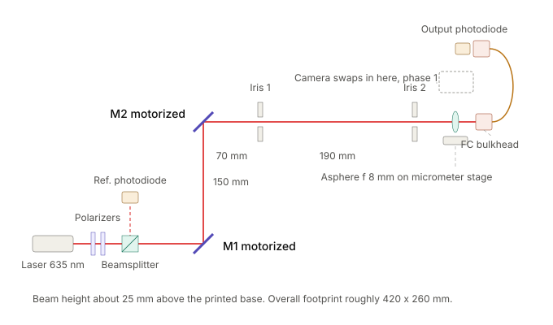

# ROS-Optics-Bench

A small, mostly 3D-printed optical bench that couples a red laser into an optical fiber by itself. Knock a mirror out of alignment and it steers its way back to maximum coupling without anyone touching a knob.



## How it works

- **Light path:** a 635 nm laser passes two crossed polarizers (a brightness knob) and a beamsplitter that sends a slice to a reference photodiode. Two kinematic mirrors, M1 and M2, fold the beam in a Z. An 8 mm aspheric lens on a micrometer stage focuses it into a fixed FC fiber connector, and the fiber loops to an output photodiode.
- **Actuation:** each mirror's tip and tilt adjusters are turned by a NEMA 8 stepper through a hex bit, giving four motorized axes. Mirrors 150 mm apart control both the beam's angle and its position at the fiber.
- **Score:** output power divided by reference power, which cancels laser flicker. An optimizer steers the four axes to maximize it.
- **Mechanics:** everything sits on a doweled, printed base so parts can be removed and replaced repeatably.

## Phases

1. **Beam steering.** Motorize the mirrors and use a camera plus two irises to put the beam on a known axis by spot position.
2. **Fiber coupling.** Swap the camera for the lens and fiber, then climb to maximum coupled power. Start with multimode fiber, then move to single-mode.
3. **Demo.** Bump a mirror and watch it recover.

## Electronics

| Part | Role |
| --- | --- |
| ESP32 | Real-time side: steppers, soft limits, photodiode sampling |
| 4x TMC2209 on one UART bus | Stepper drivers |
| ADS1115 (16-bit ADC) + BPW34 photodiodes with TIA | Reference and output power |
| Jetson (ROS 2) | Camera, optimizer, experiment control |
| Arducam OV9281 (global shutter, UVC) | Beam profiler for phase 1 |

## Repository layout

```
cad/                   Mechanical CAD (Onshape STEP exports)
  assemblies/          Full assemblies, e.g. the motor-mirror assembly
  parts/               Individual printed or machined parts
  print/               STL / 3MF files ready to slice
  vendor/              Purchased-part models (motors, mounts, optics)
docs/                  Notes, drawings, bench layout, test results
electronics/           Wiring diagrams, schematics, pinouts
firmware/optics_bench/ Arduino IDE sketch for the ESP32
  optics_bench.ino     setup() and loop()
  config.h             Pin map, bus addresses, motor limits
  src/motion/          TMC2209 drivers, stepping, homing, soft limits
  src/sensing/         ADS1115 reads, photodiode ratio
  src/comms/           Serial protocol to the host
host/ros2_ws/src/      ROS 2 packages for the Jetson
tools/                 Bench scripts: calibration, hysteresis tests, plotting
```

## Building the firmware

1. In the Arduino IDE, install the ESP32 boards package (Boards Manager, "esp32" by Espressif).
2. Open `firmware/optics_bench/optics_bench.ino`.
3. Select your ESP32 board and port, then Upload. Serial Monitor runs at 115200 baud.

Code in `src/` is compiled with the sketch automatically. Record any library added through the Library Manager here so the build can be reproduced.

## Status

Early setup. The mechanical design is in progress in Onshape; firmware and host code have not been started.
