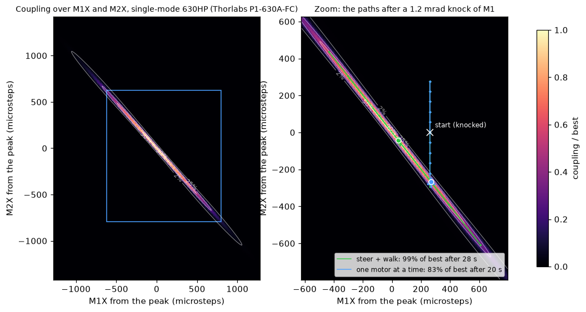

# ROS-Optics-Bench

A small, mostly 3D-printed optical bench that couples a red laser into an optical fiber by itself. Knock a mirror out of alignment and it steers its way back to maximum coupling without anyone touching a knob.


Parts list: [docs/bom](docs/bom/README.md) (source: `docs/bom/bom.csv`).

## How it works

- **Light path:** a 635 nm laser passes two crossed polarizers (a brightness knob) and a beamsplitter that sends a slice to a reference photodiode. Two kinematic mirrors, M1 and M2, fold the beam in a Z. An 8 mm aspheric lens on a micrometer stage focuses it into a fixed FC fiber connector, and the fiber loops to an output photodiode.
- **Actuation:** each mirror's tip and tilt adjusters are turned by a NEMA 8 stepper through a hex bit, giving four motorized axes. Mirrors 150 mm apart control both the beam's angle and its position at the fiber.
- **Score:** output power divided by reference power, which cancels laser flicker. An optimizer steers the four axes to maximize it.
- **Mechanics:** everything sits on a doweled, printed base so parts can be removed and replaced repeatably.

## Phases

1. **Beam steering.** Motorize the mirrors and use a camera plus two irises to put the beam on a known axis by spot position.
2. **Fiber coupling.** Swap the camera for the lens and fiber, then climb to maximum coupled power. Start with multimode fiber, then move to single-mode.
3. **Demo.** Bump a mirror and watch it recover.

## Electronics

| Part | Role |
| --- | --- |
| Adafruit ESP32 Feather V2 | Real-time side: steppers, soft limits, photodiode sampling |
| 4x Adafruit TMC2209 breakout on one UART bus | Stepper drivers |
| ADS1115 (16-bit ADC) + BPW34 photodiodes with TIA | Reference and output power |
| Jetson (ROS 2) | Camera, optimizer, experiment control |
| Arducam OV9281 (global shutter, UVC) | Beam profiler for phase 1 |

## Repository layout

```
cad/                   Mechanical CAD (Onshape STEP exports)
  assemblies/          Full assemblies, e.g. the motor-mirror assembly
  parts/               Individual printed or machined parts
  print/               STL / 3MF files ready to slice
  vendor/              Purchased-part models (motors, mounts, optics)
docs/                  Notes, drawings, bench layout, test results
electronics/           Wiring diagrams, pinouts
  pcb/                 KiCad projects (control board, photodiode amp), generators, fab outputs
firmware/optics_bench/ Arduino IDE sketch for the ESP32
  optics_bench.ino     setup() and loop()
  config.h             Pin map, bus addresses, motor limits
  src/motion/          TMC2209 drivers, stepping, homing, soft limits
  src/sensing/         ADS1115 reads, photodiode ratio
  src/comms/           Serial protocol to the host
host/ros2_ws/          ROS 2 Humble workspace for the Jetson (driver, camera, launch files)
tools/                 Bench scripts: calibration, hysteresis tests, plotting
  bench_link.py        Serial and simulator links to the controller, shared by the GUI and ROS
  bench_twin/          Simulator of the bench and the auto-align routine
```

## Building the firmware

1. In the Arduino IDE, install the ESP32 boards package (Boards Manager, "esp32" by Espressif).
2. Install the libraries below with the Library Manager.
3. Open `firmware/optics_bench/optics_bench.ino`.
4. Select your ESP32 board and port, then Upload. Serial Monitor runs at 115200 baud with newline line endings.

Code in `src/` is compiled with the sketch automatically. Record any library added through the Library Manager here so the build can be reproduced.

| Library | Version | Used for |
| --- | --- | --- |
| TMCStepper (teemuatlut) | 0.7.3 | TMC2209 register setup over UART |
| AccelStepper (Mike McCauley) | 1.64 | Ramped STEP/DIR motion |
| Adafruit ADS1X15 | 2.6.2 | ADS1115 photodiode ADC over I2C (pulls in Adafruit BusIO) |

The firmware was last built with the esp32 boards package 3.3.7.

The control board and photodiode amplifier PCBs (KiCad 10, with Gerbers ready to order) are in [electronics/pcb](electronics/pcb/README.md), and every cable on the bench is in [electronics/system_wiring.svg](electronics/system_wiring.svg).

Every pin is set in `firmware/optics_bench/config.h`. The wiring diagram and full pin table for the Feather ESP32 V2, the four Adafruit TMC2209 breakouts, the laser, the ADS1115 and the two photodiode amplifier boards are in [electronics/wiring.md](electronics/wiring.md).

## Bench test panel

`tools/test_gui.py` is a small desktop app for the first bench tests: laser on/off, jog, nudge and go-to for the four mirror motors, and live photodiode readings. It is a dark-mode Qt window built on PySide6 (the LGPL Qt binding) and pyserial, both listed in `tools/requirements.txt`.

```
py -3 -m pip install -r tools/requirements.txt
py -3 tools/test_gui.py          # pick the ESP32's COM port, Connect
py -3 tools/test_gui.py --sim    # try it without hardware
```

`py -3` picks the regular Python install on Windows; a bare `python` can resolve to another bundled interpreter such as KiCad's.

- **Positions** are in microsteps, 3200 per adjuster turn. One turn of a 100 TPI adjuster is 254 um, so a full step is about 1.3 um of screw travel.
- **Zero and soft limits.** "Reset to 0" on a motor's row calls its current knob position zero without moving it, and "Reset all to 0" does all four. Use them whenever the stored position has stopped matching reality, for example after turning an adjuster by hand. The soft limits (default -3 to +3 turns, adjustable up to +-8) stay relative to zero, because the hex bit only has about 4 turns of engagement one way. Positions and limits are saved to flash and survive a power cycle. If power drops mid-move, the panel warns that positions may be off until you reset all four.
- **Coil release.** Like the featherv2 sketch, a motor is powered only while it moves: it is released 0.5 s after it stops, so the motors stay cool between moves, and the non-back-driving adjuster screws hold the mirror. The **On** box shows whether a motor is powered; ticking it holds that motor powered until you untick it. `AUTO_RELEASE` in `config.h` turns this off.
- **Hold-to-jog** (the double arrows) keeps a motor running while the button is held. The firmware stops it by itself if the panel stops refreshing the jog, so a crashed GUI can't run a motor to its limit.
- **Keys:** arrows move M1 (Left/Right = M1X, Down/Up = M1Y), A/D and S/W move M2X and M2Y by the selected step, L toggles the laser, Esc stops everything.
- **Diag** shows the TMC2209 status (current, StealthChop, overtemperature, short and open-load flags). A driver that doesn't answer on the UART shows a red dot and refuses to move.
- **Auto-align.** Pick the fiber on the bench and press **Align**. It finds the light, then peaks the out/ref ratio by steering with M2 and walking M1 and M2 together (see [Bench twin](#bench-twin-simulator)). The first run for a fiber also measures the walk directions. Later runs recover from wherever the beam is, for example after a knock. If there is no light on the output photodiode, it first searches with M2 up to 0.4 turn either way. **Stop** or Esc ends it. It uses the same serial commands as the rest of the panel, but it has only been run against the simulator so far.
- **Photodiodes.** Tick **Live** to stream the reference and output photodiode voltages (5 to 50 readings a second, each the average of all ADC samples since the last one). The panel shows each voltage with its photocurrent and optical power, the output/reference ratio with the best ratio seen and the motor positions where it happened, and a rolling plot (log scale optional). **Measure dark** switches the laser off briefly, records the offsets and subtracts them from then on. **ADC range** fixes the ADS1115 gain instead of auto-ranging, and **Save CSV** writes up to the last 10 minutes of readings.
- **Simulator.** `--sim` (or the Simulator port) runs the bench twin behind the same serial commands: the photodiodes read what the modelled optics couple into the chosen fiber, with the best position hidden a little way from zero. **Knock M1** and **Knock M2** tilt a mirror by 0.5 to 2 mrad as if bumped, **Unknock** takes the knocks out, and **Peak?** shows where the best position is. Knock, then Align, to watch it recover. The same commands work from the console as `SIM KNOCK M1 [mrad]`, `SIM PEAK`, `SIM FIBER sm630` and `SIM RESET`.

The serial protocol is plain text and documented in `firmware/optics_bench/src/comms/protocol.h`, so the Serial Monitor or the Jetson can use the same commands.

### First power-up checklist

1. Flash the firmware and connect. A driver whose 12 V supply is off doesn't answer on the UART, so it shows a red dot and a "driver offline" warning.
2. With the 12 V supply on, send `REPROBE ALL` (or just move the axis, which retries). The dots should go green, and the connection bar should say `slots=ok`.
3. Take the hex bits out of the adjusters and nudge each motor by 1/4 turn to check which way positive turns. Flip it with `invert` in `config.h` if needed.
4. Refit the bits, press "Reset all to 0", and start aligning.
5. With the ADS1115 and photodiode boards connected, the photodiode panel should show `ADC: ok`. Cover each diode and shine a light on it to check its channel, then press **Measure dark** with the room lit as it will be during runs.

## Bench twin (simulator)

`tools/bench_twin` is a small physical model of the bench, used to size and test the alignment routine before the hardware can. It models:

- **Optics:** the 7 x 3 mm laser beam cut by the 2 mm aperture, the two mirrors 150 mm apart, iris 2 at 3 mm, and the f = 8 mm lens. Single-mode coupling is the overlap of the laser field with the fiber mode, including the aperture's hard edge. Multimode coupling is the share of the focused spot that the core accepts.
- **Motors:** 100 TPI adjusters on a 17.3 mm lever, a little play in each hex coupling, and a little crosstalk between each mount's two axes.
- **Photodiodes:** the reference and output photodiodes through the ADS1115, with noise and dark offsets.
- **Knocks:** a bumped mirror mount tilts by an amount the motors don't know about.

```
py -3 tools/twin.py                  key numbers (--fiber sm630, mm50 or smf28)
py -3 tools/twin.py ceiling          best coupling vs aperture size and lens focal length
py -3 tools/twin.py trials --compare knock a mirror and recover, 50 times, both methods
py -3 tools/twin.py landscape        redraws the picture below (needs matplotlib)
py -3 -m unittest discover tools/tests
```

What it says so far, for the single-mode fiber:

- **The peak is narrow and diagonal.** Moving M2X alone, coupling falls to 1/e within 25 microsteps (1.5 full steps). Moving M1 and M2 together the opposite way ("walking"), it stays up for about 580 microsteps. So in motor coordinates the peak is a valley 23 times longer than it is wide, running diagonally across M1 and M2. Adjusting one motor at a time stalls on its ridge.
- **Recovery.** The auto-align routine steers with M2 and walks with M1 and M2 together, the way it is done by hand. In 100 simulated knocks of 0.3 to 3 mrad on a random mirror, it got all 100 back above 99.9% of the best coupling, with a median of 19 s and a worst case of 66 s (at 60 RPM and 600 RPM/s). One motor at a time got 59 of 100 back to 90%, and its worst case ended at 41%. Most of the time goes into finding the light again. Knocks of M1 above about 5 mrad can end up outside the search range (7 of 36 in a run of 3 to 6 mrad knocks).
- **The 2 mm aperture is close to ideal.** With the f = 8 mm lens the best coupling is 83%, against 85% for the best aperture and lens combination tried (2 mm with f = 9 mm). Without the aperture it drops to 25%, because the 7 x 3 mm beam is much bigger than the fiber mode seen at the lens (1.5 mm).
- **The play in the hex couplings matters.** One degree of play is about 9 microsteps, a third of the single-mode peak's width. The routine therefore approaches every point from the same side.



The numbers rest on estimates to replace with bench measurements, all set in `tools/bench_twin/bench.py` and `optics.py`:

| Estimate | Value used | How to measure |
| --- | --- | --- |
| Adjuster lever arm | 17.3 mm (from the 24.5 mm motor spacing) | Scan M2X across the peak; the width scales with it |
| Play per hex coupling | 1 degree (9 microsteps) | Hysteresis test: approach the same point from both sides |
| Laser beam | 7 x 3 mm across (taken as the 1/e^2 width) | Camera or knife edge |
| Fiber mode | 4.2 um across (630HP) | Datasheet |
| Lens clear aperture | 5 mm | The lens listing |
| Beamsplitter, laser power, polarizer setting | 50/50, 0.9 mW, 30% | Photodiode volts |

## ROS 2 on the Jetson

`host/ros2_ws` holds ROS 2 Humble packages for the Jetson: a driver node that puts the ESP32 (or the simulator) on ROS topics, services and actions, with Align as an action; a node that finds the laser spot on the OV9281; and launch files. They use `tools/bench_link.py` and `tools/bench_twin` directly, so they align the same way the test panel does. Setup and usage: [host/ros2_ws/README.md](host/ros2_ws/README.md).

```
ros2 launch optics_bench_bringup bench.launch.py                          # on the simulator
ros2 launch optics_bench_bringup bench.launch.py port:=/dev/optics_bench  # on the bench
```

## Status

Bench testing. The firmware drives the laser and the four mirror motors and reads both photodiodes through the ADS1115, and `tools/test_gui.py` is the test panel. The photodiode boards are designed but not yet built or tested. The ROS 2 packages build and run against the simulator on Humble but haven't run on the Jetson, the ESP32 or the camera yet.
