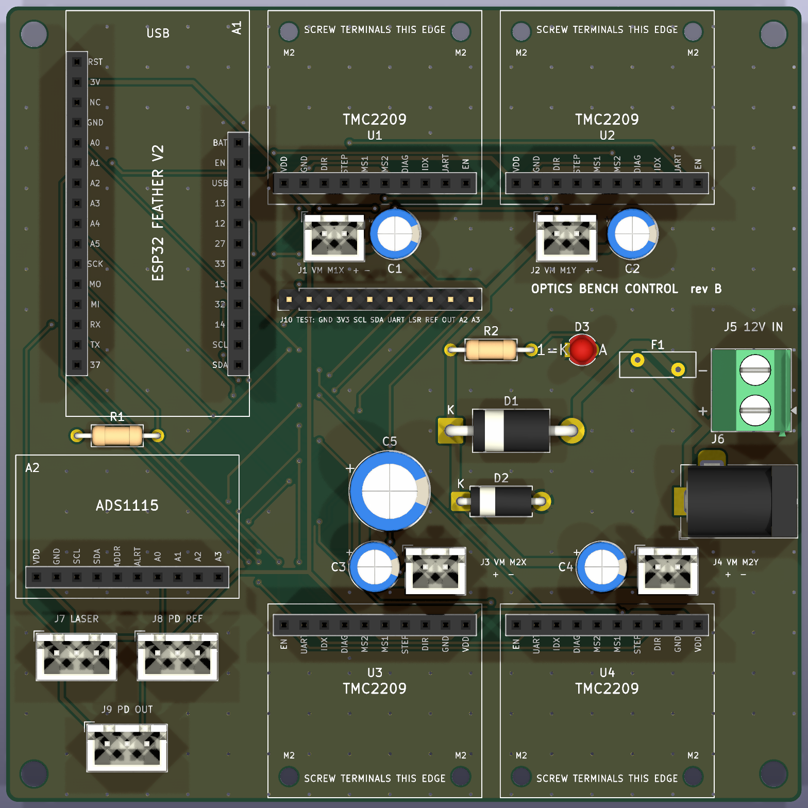

# Circuit boards

Two KiCad 10 projects replace the perfboard wiring:

| Board | Size | What it does |
| --- | --- | --- |
| [control_board](control_board) | 100 x 100 mm, 2 layers | Carrier for the ESP32 Feather V2, the four TMC2209 breakouts and the ADS1115. Adds the 12 V input protection, a VM feed for each driver, laser and photodiode plugs, and a test header for the Analog Discovery 3. |
| [pd_amp](pd_amp) | 34.3 x 25.4 mm, 2 layers | Photodiode amplifier: BPW34 into an MCP6002 transimpedance amp. Build two, one for the reference diode and one for the fiber output. |



How it all connects: [../system_wiring.svg](../system_wiring.svg) and [../wiring.md](../wiring.md).

## Why a carrier board and not chip-down parts

The Feather, the TMC2209 breakouts and the ADS1115 plug into female headers. The TMC2209 breakouts keep their screw terminals: each one plugs in by its 10-pin logic header only, with the terminals along the board's top or bottom edge and the wire entries facing out. The carrier board itself only has through-hole parts that cost a few dollars in total, and it fits the cheapest price tier at JLCPCB and PCBWay (100 x 100 mm, 2 layers).

- The breakouts are already on hand, and this firmware already runs on them.
- A chip-down TMC2209 is a QFN-28 with a thermal pad. It needs fab assembly and its own layout checks (sense resistors, charge pump, thermal vias), and a board with an ESP32 module would need the USB and boot circuits too. That is a second board bring-up for no gain on a four-motor bench.
- A failed driver or Feather is swapped by unplugging it.
- Every pin matches `firmware/optics_bench/config.h`, so the firmware doesn't change.

## Ordering

Upload `fab/<board>/<board>_gerbers.zip` as-is. Defaults are fine: 2 layers, 1.6 mm FR-4, 1 oz copper, HASL, any mask colour. The zip holds the copper, mask, silkscreen, outline and one Excellon drill file. There are no SMD parts, so no stencil or assembly files are needed.

Parts: `fab/<board>/<board>_bom.csv`. All the parts are through-hole and stocked at DigiKey, Mouser and LCSC. The part numbers are suggestions, and any part with the same footprint fits.

## Assembly notes (control board)

1. Solder the low parts first: R1, R2, D1-D3, F1, then J10, the JST-XH plugs, J5, J6 and the capacitors (mind the + marks).
2. Solder the female headers for A1 (16 + 12 pins), U1-U4 (10 pins each) and A2 (10 pins). Plug the boards in while soldering so the headers stay straight.
3. The TMC2209 breakouts keep their screw terminals. Each one plugs in by its logic header, with the terminal edge at the board edge. Two M2 x 11 mm standoffs under the terminal-end mounting holes (marked M2 on the board) hold that end up while you tighten the screws. Check the standoff height against your header stack (about 8.5 mm socket plus the 2.5 mm plastic of the male header).
4. Wire each motor straight into its breakout's 1A/1B/2A/2B terminals. Run a 2-wire lead from the carrier's VM plug next to the driver (J1-J4, pin 1 = +12 V, pin 2 = GND, marked + -) into the breakout's VM + and GND terminals.
5. The UART addresses are set by the board: U1 = 0 (M1X), U2 = 1 (M1Y), U3 = 2 (M2X), U4 = 3 (M2Y). Put each breakout in its own slot.
6. Before plugging anything in, power J5 or J6 with 12 V and check that D3 lights, that J1-J4 read about 11.5 V (after the Schottky), and that 3V3 isn't shorted to GND.

## Connectors

Control board:

| Ref | Type | Pins |
| --- | --- | --- |
| J1-J4 | JST-XH 2 | VM feed for the M1X, M1Y, M2X and M2Y breakouts: 1 = +12 V, 2 = GND. A short lead goes to the breakout's VM + / GND screw terminals |
| U1-U4 terminals | Breakout screw terminals, 2.54 mm | Motor coils: 1A/1B = coil A, 2A/2B = coil B, plus VM + / GND from J1-J4 |
| J5 | Screw terminal, 5.08 mm | 12 V in: + and - (marked) |
| J6 | Barrel jack 5.5 x 2.1 mm | 12 V in, centre positive (same net as J5, so use one of them) |
| J7 | JST-XH 3 | Laser: 1 = 3V3, 2 = TTL (GPIO 21), 3 = GND |
| J8 | JST-XH 3 | Reference photodiode board: 1 = 3V3, 2 = PD_REF (ADS1115 A0), 3 = GND |
| J9 | JST-XH 3 | Output photodiode board: 1 = 3V3, 2 = PD_OUT (ADS1115 A1), 3 = GND |
| J10 | 1x10 pin header | Test: 1 GND, 2 3V3, 3 SCL, 4 SDA, 5 UART bus, 6 LASER TTL, 7 PD_REF, 8 PD_OUT, 9 ADS1115 A2, 10 A3 |
| A1 | Feather V2 socket | USB-C faces the top edge |

Photodiode board: J1 (JST-XH 3) is 1 = 3V3, 2 = VOUT, 3 = GND, which matches J8 and J9, so the cable is wired 1:1.

## Design notes

- **12 V input.** A 2 A PTC fuse (F1), a 1N5822 Schottky in series for reverse polarity (about 0.4 V drop), an 18 V bidirectional TVS (D2), 470 uF bulk capacitance, and 100 uF at each driver's VM plug, on top of the breakout's own 22 uF. The motor current is well under 1 A in total at 350 mA RMS per motor.
- **Ground.** Both layers are ground pours, stitched with vias. The photodiode signal returns through the pour straight back to the ADS1115.
- **DIAG.** Each driver's DIAG output goes to an input-only Feather pin (M1X to I34/A2, M1Y to I39/A3, M2X to I36/A4, M2Y to I37). The firmware doesn't read them yet, so they're there for stall detection later. INDEX isn't connected.
- **Tracks.** Signals are 0.3 mm, 3V3 is 0.5 mm and 12 V is 1.0 mm, and a 0.4 mm ground tree runs under the pours. Motor current never crosses the carrier: it goes from the breakout's terminals straight to the motor. The clearance is 0.2 mm, or 0.3 mm on 12 V. Every rule is in the `.kicad_pro` files.
- **Mounting.** The control board has an M3 hole in each corner, 93 mm apart, which doesn't land on the bench's 25 mm insert grid, so it needs a printed plate or standoffs. The photodiode board has two M3 holes 25 mm apart, centred on the BPW34, so it bolts straight onto the grid.

## Regenerating

The schematics and boards are generated from `gen/design.py`, which is the only place parts, pins and positions are defined. After editing it:

```
py -3 electronics/pcb/gen/build.py
```

The generators look for KiCad in `C:/Users/Vince/AppData/Local/Programs/KiCad/10.0`. To use another install, set `KICAD_DIR`.

That runs, in order:

1. `make_lib.py`: the custom symbols and socket footprints in `lib/`.
2. `make_sch.py`: the schematics.
3. `kicad-cli`: the netlist.
4. `make_pcb.py` (KiCad's Python): placement, routing and ground pours.
5. ERC, and DRC with schematic parity.
6. The fab outputs in `fab/`.

It stops with an error if ERC or DRC finds anything or a net is left unrouted. A board with ERC or DRC errors keeps its previous `fab/<board>/` files, so the zip there is always the last good build; the reports go to `fab/<board>_check/`. The router is a small A* grid router in `gen/route.py`.

To open a board in KiCad and edit it by hand, open `control_board/control_board.kicad_pro`. A rerun of `build.py` overwrites manual edits, so once the board is being edited by hand, stop regenerating it.

## Open assumptions

- The breakout's screw terminals take wires from the breakout's outer edge, so with the terminal edge on the board edge the wires come in from outside the board. Check the direction on one breakout. If the entries face the other way, swap each pair of driver slots in `gen/design.py`.
- The M2 standoff holes sit under the breakout's terminal-end mounting holes, taken from Adafruit's board file.
- The ADS1115 is the Adafruit 1085 layout (one 10-pin header, board above it). The newer STEMMA QT version has the same header order.
- The Jetson is the USB host for the Feather and the camera.
