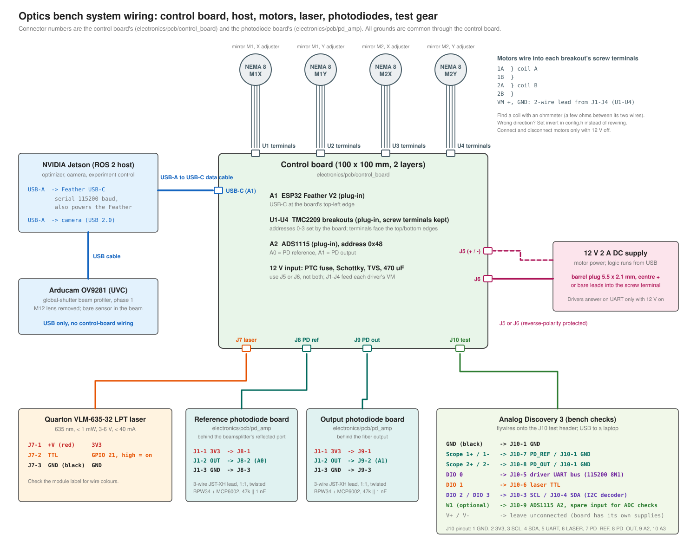
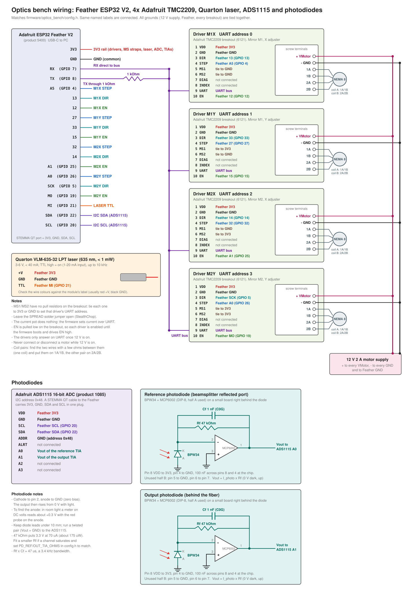

# Wiring: ESP32, motor drivers, laser and photodiodes

The electronics can be built two ways:

- **Control board (recommended).** A 2-layer carrier PCB takes the Feather, the four TMC2209 breakouts and the ADS1115 on sockets, and makes every connection below in copper. Cables go to the motors, laser, photodiode boards and 12 V supply. For the board, ordering and assembly, see [pcb/README.md](pcb/README.md). For every cable on the bench, see the system diagram below.
- **Hand wiring** on perfboard, using the pin tables below. The nets are the same.

Pin-level wiring (the same connections the control board makes):

Parts:

- [Adafruit ESP32 Feather V2](https://www.adafruit.com/product/5400) (product 5400)
- 4x [Adafruit TMC2209 stepper driver breakout](https://www.adafruit.com/product/6121) (product 6121)
- Quarton VLM-635-32 LPT laser module (635 nm, TTL modulation)
- [Adafruit ADS1115 16-bit ADC breakout](https://www.adafruit.com/product/1085) (product 1085) and a STEMMA QT cable
- 2x photodiode boards, each with a BPW34 photodiode, an MCP6002 op-amp (DIP-8), a 47 kOhm 1% resistor, a 1 nF C0G capacitor and a 100 nF decoupling capacitor

The pins match `firmware/optics_bench/config.h`. If you change a pin there, change it here too, and regenerate the diagram with `python electronics/make_wiring_svg.py electronics/wiring.svg`.

## Feather ESP32 V2 pins

| Feather pad | GPIO | Goes to |
| --- | --- | --- |
| 3V3 | | VDD on all four drivers, MS1/MS2 straps that are tied high, laser +V, ADS1115 VDD, both photodiode boards |
| GND | | GND on all four drivers, laser GND, 12 V supply minus, ADS1115 GND and ADDR, both photodiode boards |
| RX | 7 | UART bus (direct) |
| TX | 8 | UART bus through a 1 kOhm resistor |
| A5 | 4 | M1X STEP |
| 13 | 13 | M1X DIR (also the Feather's red LED, so it flickers) |
| 12 | 12 | M1X EN |
| 27 | 27 | M1Y STEP |
| 33 | 33 | M1Y DIR |
| 15 | 15 | M1Y EN |
| 32 | 32 | M2X STEP |
| 14 | 14 | M2X DIR |
| A1 | 25 | M2X EN |
| A0 | 26 | M2Y STEP |
| SCK | 5 | M2Y DIR |
| MO | 19 | M2Y EN |
| MI | 21 | Laser TTL |
| SDA | 22 | ADS1115 SDA |
| SCL | 20 | ADS1115 SCL |
| A2 | 34 (input only) | M1X DIAG (control board; optional when hand-wiring) |
| A3 | 39 (input only) | M1Y DIAG (control board) |
| A4 | 36 (input only) | M2X DIAG (control board) |
| 37 | 37 (input only) | M2Y DIAG (control board) |

## TMC2209 breakouts

Header pins in board order. Each driver's MS1/MS2 pins set its UART address.

| Pin | M1X (addr 0) | M1Y (addr 1) | M2X (addr 2) | M2Y (addr 3) |
| --- | --- | --- | --- | --- |
| 1 VDD | 3V3 | 3V3 | 3V3 | 3V3 |
| 2 GND | GND | GND | GND | GND |
| 3 DIR | GPIO 13 | GPIO 33 | GPIO 14 | GPIO 5 (SCK) |
| 4 STEP | GPIO 4 (A5) | GPIO 27 | GPIO 32 | GPIO 26 (A0) |
| 5 MS1 | GND | 3V3 | GND | 3V3 |
| 6 MS2 | GND | GND | 3V3 | 3V3 |
| 7 DIAG | A2 (I34) | A3 (I39) | A4 (I36) | 37 (I37) |
| 8 INDEX | not connected | not connected | not connected | not connected |
| 9 UART | UART bus | UART bus | UART bus | UART bus |
| 10 EN | GPIO 12 | GPIO 15 | GPIO 25 (A1) | GPIO 19 (MO) |

Screw terminals on each breakout:

| Terminal | Goes to |
| --- | --- |
| + (VMotor) | 12 V supply plus (control board: VM plug J1-J4 pin 1, next to the driver) |
| - (GND) | 12 V supply minus (control board: VM plug J1-J4 pin 2) |
| 1A / 1B | One motor coil |
| 2A / 2B | The other motor coil |

DIAG goes high on a driver fault or stall. The firmware doesn't read it yet, and on a hand-wired build it can stay unconnected.

On the control board each breakout keeps its screw terminals and plugs in by the 10-pin logic header only. The motors wire straight into the breakout's terminals. A 2-wire lead from the carrier's VM plug next to each driver (J1-J4: pin 1 = +12 V, pin 2 = GND) goes to the breakout's + and - terminals.

## Laser (Quarton VLM-635-32 LPT)

| Laser wire | Goes to |
| --- | --- |
| +V | Feather 3V3 (module runs on 3-6 V and draws under 40 mA) |
| GND | Feather GND |
| TTL | Feather MI (GPIO 21). High turns the laser on. The input takes 1-20 mA, which a GPIO can drive directly. |

Check which wire is which on the module's label. Red is usually +V and black is usually GND.

## Photodiodes and ADC

Two BPW34 photodiodes measure the light: the reference diode sits behind the beamsplitter's reflected port and the output diode sits behind the fiber. Each diode has its own transimpedance amplifier (TIA) on a small board right behind it, which turns the photocurrent into a voltage. The ADS1115 reads both voltages and sends them to the Feather over I2C.

### ADS1115 breakout

| ADS1115 pin | Goes to |
| --- | --- |
| VDD | Feather 3V3 |
| GND | Feather GND |
| SCL | Feather SCL (GPIO 20) |
| SDA | Feather SDA (GPIO 22) |
| ADDR | GND, which sets the I2C address to 0x48 |
| ALRT | not connected |
| A0 | Vout of the reference photodiode board |
| A1 | Vout of the output photodiode board |
| A2, A3 | not connected |

A STEMMA QT cable between the ADS1115 and the Feather's STEMMA QT port carries VDD, GND, SDA and SCL in one plug. The Feather V2 powers that port from GPIO 2, which the ESP32 board package switches on at boot. Then only ADDR, A0 and A1 need wires.

### Photodiode board (build two)

The [pd_amp PCB](pcb/README.md) is this circuit, plus a 100 Ohm resistor in series with the output that isolates the cable capacitance. Its J1 (1 = 3V3, 2 = VOUT, 3 = GND) plugs 1:1 into control board J8 (reference, A0) or J9 (output, A1). The table below covers a perfboard build.

| Part | Connection |
| --- | --- |
| BPW34 cathode | MCP6002 pin 2 (input A, minus) |
| BPW34 anode | GND |
| Rf 47 kOhm | Between pin 1 (output A) and pin 2 |
| Cf 1 nF C0G | Across Rf, also between pin 1 and pin 2 |
| MCP6002 pin 3 (input A, plus) | GND |
| MCP6002 pin 8 (VDD) | Feather 3V3 |
| MCP6002 pin 4 (VSS) | GND |
| 100 nF | Between pins 8 and 4, right at the chip |
| MCP6002 pin 5 | GND (half B is unused) |
| MCP6002 pin 6 | Pin 7 (half B as a grounded follower) |
| Pin 1 (Vout) | ADS1115 A0 (reference board) or A1 (output board) |

The diode works at zero bias, so the output sits at 0 V in the dark and rises as `Vout = I_photo x Rf`.

- **Finding the anode.** In room light, a multimeter on DC volts reads about +0.3 V across the diode with the red probe on the anode.
- **Why 47 kOhm.** The laser is under 1 mW. A BPW34 gives about 0.4 A/W at 635 nm, so 47 kOhm reaches the 3.3 V rail at 70 uA, about 175 uW on the diode. The ADS1115's gain ranges cover the dim end, down to about 0.4 nW per count. If a channel sits near 3.3 V, fit a smaller Rf on that board and change `PD_REF_TIA_OHMS` or `PD_OUT_TIA_OHMS` in `config.h`, because the test panel works out microwatts from those values.
- **Bandwidth.** Rf x Cf is 47 us, a 3.4 kHz bandwidth, which is much faster than the ADC samples and keeps the amplifier stable.
- **Leads.** Keep the diode leads under 10 mm, and run Vout and GND to the ADS1115 as a twisted pair.
- **Offset.** The MCP6002's input offset is up to ±4.5 mV. A positive offset just lifts the dark reading by a few millivolts, and `PD DARK` in the firmware measures it with the laser off and subtracts it. A negative offset can't be subtracted: the output sits clipped at 0 V until the photocurrent times Rf is larger than the offset, so up to about 240 nW of light (at 4.5 mV and 47 kOhm) reads as nothing. That matters for the faint first light through a fiber, mostly on the output board. To check, cap the output photodiode, darken the room and press Measure dark: an OUT dark of 0.5 mV or more is fine. If it reads about 0 V while the reference board reads clearly positive, swap the two boards' MCP6002 chips (the reference channel sits at 0.5-0.8 V, where the offset sign doesn't matter).

## Things to know

- **One ground.** The 12 V supply minus, the Feather GND, every breakout GND and both photodiode boards must all be connected together. Run the photodiode grounds back to the Feather rather than to the motor supply, so motor current doesn't flow through them.
- **UART bus.** The Adafruit breakout connects its UART pin straight to the chip with no resistor. Join all four UART pins into one bus. Connect the Feather RX to the bus directly and the Feather TX through a 1 kOhm resistor.
- **Addresses.** MS1 and MS2 have no pull resistors on the breakout. Tie every one of them to 3V3 or GND as shown above; don't leave them floating.
- **12 V comes first for UART.** The TMC2209 runs its logic from the motor supply, so a driver doesn't answer on UART until 12 V is on. The firmware retries when you move that axis, or you can send `REPROBE ALL`.
- **Sense resistors are 0.05 Ohm** on this breakout, not the 0.11 Ohm used on BTT/FYSETC modules. `config.h` has `R_SENSE 0.05f`. With the wrong value the motors would get almost double the current you set.
- **Current pot and SPREAD jumper.** The firmware sets the motor current and StealthChop over UART, so the pot does nothing. Leave the SPREAD solder jumper open.
- **EN at power-up.** The breakout pulls EN low (a 20 kOhm resistor), so the drivers are enabled until the firmware boots and drives EN high. That pull-down also keeps GPIO 12 low at reset, which the ESP32 needs to boot.
- **Motor coils.** To find a coil pair, measure resistance between the motor's wires. The two wires with a few ohms between them are one coil: put them on 1A/1B and the other pair on 2A/2B. If a motor turns the wrong way, set `invert` for that axis in `config.h` instead of rewiring.
- Never plug or unplug a motor while the 12 V supply is on.

## Host and bench instruments

| From | To | Cable |
| --- | --- | --- |
| Jetson USB-A | Feather USB-C | USB data cable. Serial at 115200 baud, and it powers the Feather's 3V3 rail |
| Jetson USB-A | Arducam OV9281 | USB (UVC camera, beam profiler for phase 1). No other wiring |
| 12 V 2 A supply | Control board J6 (5.5 x 2.1 mm, centre +) or J5 (screw terminal) | One or the other |
| Analog Discovery 3 | Control board J10 test header | Flywires: GND to pin 1, scope 1+ to pin 7 (PD_REF), scope 2+ to pin 8 (PD_OUT), DIO 0 to pin 5 (UART bus), DIO 1 to pin 6 (laser TTL), DIO 2/3 to pins 3/4 (SCL/SDA). Leave V+ and V- unconnected |

The Analog Discovery's ground is the laptop's USB ground. Its GND flywire ties it to the bench ground at J10, and the scope's minus inputs go to GND too.
